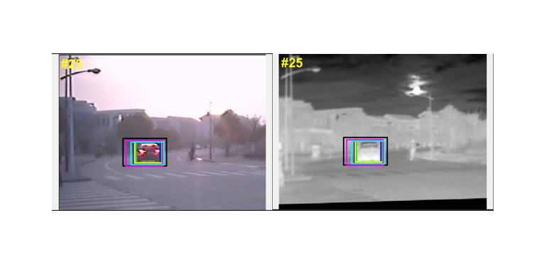
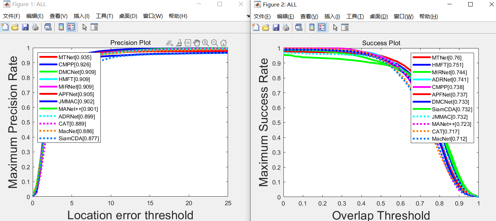

# GTOT-toolkit
We have developed a MATLAB-based evaluation toolbox for GTOT, which includes 

* **methods for calculating PR and SR metrics, generating metric curves, and comparing with existing trackers**
* **the original tracking result files for the majority of existing trackers**
* **visualization and analysis methods for tracking**
* etc

## ✏️ File structrue✏️ 
GTOT-toolkit 

  ├─BBresults  :contains the txt format tracker results
  
  ├─ERRresults  :contains the mat format tracker results. This type of file can be directly read by Matlab. Some trackers only provide results in this format. You can use the toolbox and the text-type(.txt) results to generate results in the Matlab (.mat) format
  
  ├─sequencesAttr  :contains the attributes of sequences

## 🚀Quick Start🚀
### Preparasion

1. You need Matlab to run the toolkit

2.Prepare your own tracking results and save them in the format "trackerName_sequenceName.txt", for example, ADRNet_BlackCar.txt. Additionally, ensure that you save them in the folder named after your tracker within the "BBresults" directory, for instance, ADRNet.

BBresults  
  ├─ADRNet  
  │────ADRNet_BlackCar.txt  
  │──── ......  
  │────ADRNet_tunnel.txt  
  ├─......
  
  ├─**YOURTRACKER** 
  
  │────YOURTRACKER_BlackCar.txt  
  
  │────...... 
  
  │────YOURTRACKER_tunnel.txt  
  │    

3.Both formats for saving the tracking results are acceptable: you can save the results in the format **of(X,Y,W,H) rectangle**, where X and Y represent the coordinates of the top-left corner, and W and H represent the width and height, or you can save them in the format **of(x1,y1,x2,y2,x4,y4,x3,y3)** representing the 4 corners, where 1, 2, 3, and 4 correspond to the top-left, top-right, bottom-left, and bottom-right vertices respectively.

for example MaNet++ is saved as (X,Y,W,H) format

ADRNet is saved as (x1,y1,x2,y2,x4,y4,x3,y3) format

4.To modify the environment path and replace the GTOT path with your dataset path, make the following changes:

* In main_attrDrawCurve.mat, modify the path at line 10.
* In calcPlotErr.m, modify the path at line 5.
* In main_GenerateMat.m, modify the path at line 6.
* In main_drawTrackersResult.m, modify the paths at lines 12 and 21.

Ensure that you update the paths to reflect the correct dataset location in each file mentioned above.

### 📈 Draw metric curves📈 

**1.To generate results in the .mat format, based on your desired format, choose the corresponding processing method at line 66 of calcPlotErr.m. You can choose between the 4corner format (x1, y1, x2, y2, x4, y4, x3, y3) or the rect format (x, y, w, h).**

**2.Modify the desired name of the tracker you wish to generate at line 13 in main_GenerateMat.m, and then proceed to execute the file. After running, you will find a folder with the same name and .mat result in ERRresult.**

**3.Execute the main_attrDrawCurve.mat file, where you can select the attribute you want to compare at line 11, including OCC LSV	FM	LI	TC	SO	DEF All .Use "all" to represent the entire dataset. Add the desired tracker for comparison at line 15..**

**4.You will then obtain the metric curve.**

### 👀Draw visualization results👀
 

**1.Execute the main_drawTrackerResults.mat file. Add the name of the tracker you want to visualize the results for at line 11. Modify the corresponding BBOX color and line style at lines 39 and 40.**

**2.You can find the visualized results in the trackingResultsDisplay folder.**
## 🏆conparision🏆
Here are the metrics of existing trackers on the GTOT dataset:

 

The sources of the trackers are indicated in the following table:

Tracker | Paper | year | Source
----|----|----|----
**MTNet**  | [MTNet: Learning Modality-aware Representation with Transformer for RGBT Tracking](https://github.com/xuboyue1999/MTNet-ICME23) | 2023 | ICME
**HMFT**  | [Visible-thermal uav tracking: A large-scale benchmark and new baseline](https://openaccess.thecvf.com/content/CVPR2022/papers/Zhang_Visible-Thermal_UAV_Tracking_A_Large-Scale_Benchmark_and_New_Baseline_CVPR_2022_paper.pdf) | 2022 | CVPR  
**MIRNet**  |  [Mirnet: A robust rgbt tracking jointly with multi-modal interaction and refinement](https://ieeexplore.ieee.org/abstract/document/9860018) | 2022 | ICME
**ADRNet**  |  [Learning Adaptive Attribute-Driven Representation for Real-Time RGB-T Tracking](https://link.springer.com/article/10.1007/s11263-021-01495-3) | 2020 | IJCV 
**CMPP**  |  [Cross-modal pattern-propagation for rgb-t tracking](https://openaccess.thecvf.com/content_CVPR_2020/html/Wang_Cross-Modal_Pattern-Propagation_for_RGB-T_Tracking_CVPR_2020_paper.html) | 2020 | CVPR    
**APFNet**  |   [Attribute-based progressive fusion network for rgbt tracking](https://ojs.aaai.org/index.php/AAAI/article/view/20187) | 2022 | AAAI
**DMCNet**  |  [Duality-gated mutual condition network for rgbt tracking](https://ieeexplore.ieee.org/abstract/document/9737634) | 2022 |IEEE TNNLS
**SiamCDA** |  [Siamcda: Complementarityand distractor-aware rgb-t tracking based on siamese network](https://ieeexplore.ieee.org/abstract/document/9399460) | 2022 | TCSVT    
**JMMAC**  |   [Jointly modeling motion and appearance cues for robust rgb-t tracking](https://ieeexplore.ieee.org/abstract/document/9364880) | 2021 |IEEE Transactions on Image Processing 
**MANet** |  [Multi-adapter RGBT tracking](https://openaccess.thecvf.com/content_ICCVW_2019/html/VOT/Li_Multi-Adapter_RGBT_Tracking_ICCVW_2019_paper.html) | 2019 |ICCVW
**CAT**  |  [ Challenge-aware RGBT tracking](https://link.springer.com/chapter/10.1007/978-3-030-58542-6_14) | 2020 |ECCV
**MacNet**  |  [  Object tracking in RGB-T videos using modal-aware attention network and competitive learning](https://www.mdpi.com/1424-8220/20/2/393) | 2020 |Sensors

