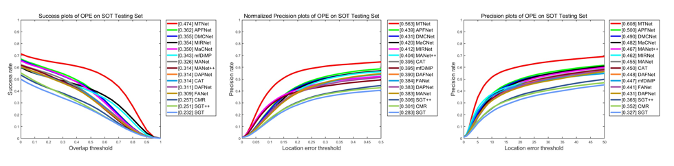

# LasHeR-Toolkit
We have developed a MATLAB-based evaluation toolbox for LasHeR, which includes 

* **methods for calculating PR、SR and NPR metrics, generating metric curves, and comparing with existing trackers**
* **the original tracking result files for the majority of existing trackers**
* etc

## ✏️ File structrue✏️ 
LasHeR-Toolkit 

  ├─tracking_results  :contains the txt format tracker results
  
  ├─tmpMat  :contains the mat format tracker results. This type of file can be directly read by Matlab. Some trackers only provide results in this format. You can use the toolbox and the text-type(.txt) results to generate results in the Matlab (.mat) format
  
  ├─annos  :groundTruth

  

## 🚀Quick Start🚀
### Preparasion

1. You need Matlab to run the toolkit

2.Prepare your own tracking results and save them in the format "sequenceName.txt", for example, 1blackteacher.txt. Additionally, ensure that you save them in the folder named "trackerName_tracking_result" within the "tracking_results" directory, for instance, APFNet_tracking_result.

BBresults  
  ├─APFNet_tracking_result  
  │────1blackteacher.txt  
  │──── ......  
  │────yellowskirt.txt  
  ├─......
  
  ├─**YOURTRACKER** 
  
  │────1blackteacher.txt   
  
  │────...... 
  
  │────yellowskirt.txt   
  │    

3.**Only one** format for saving the tracking results is acceptable: you can save the results in the format **of(X,Y,W,H) rectangle**, where X and Y represent the coordinates of the top-left corner, and W and H represent the width and height.

### 📈 Draw metric curves📈 

**1.Please modify the config_tracker.m file in utils and add the tracker you want to evaluate.**

**2.Modify the norm_dst attribute to "FALSE" on line 34 of the run_tracker_performance_evaluation.m file, and set the ranking_type attribute to "threshold" on line 68. Run the file to obtain the PR metric curve.**

**3.Modify the norm_dst attribute to "TRUE" on line 34 of the run_tracker_performance_evaluation.m file, and set the ranking_type attribute to "threshold" on line 68. Run the file to obtain the NPR metric curve.**

**2.Modify the norm_dst attribute to "FALSE" on line 34 of the run_tracker_performance_evaluation.m file, and set the ranking_type attribute to "AUC" on line 68. Run the file to obtain the SR metric curve.**

### 👀Draw visualization results👀

**coming soon**

**you can try gtot or rgbt234 toolkit to draw visualization results**

## 🏆conparision🏆
Here are the metrics of existing trackers on the LasHeR dataset:
 

The sources of the trackers are indicated in the following table:

Tracker | Paper | year | Source
----|----|----|----
**MTNet**  | [MTNet: Learning Modality-aware Representation with Transformer for RGBT Tracking](https://github.com/xuboyue1999/MTNet-ICME23) | 2023 | ICME
**APFNet**  |   [Attribute-based progressive fusion network for rgbt tracking](https://ojs.aaai.org/index.php/AAAI/article/view/20187) | 2022 | AAAI
**DMCNet**  |  [Duality-gated mutual condition network for rgbt tracking](https://ieeexplore.ieee.org/abstract/document/9737634) | 2022 |IEEE TNNLS
**FANet** |  [Quality-aware feature aggregation network for robust rgbt tracking](https://ieeexplore.ieee.org/abstract/document/9035457) | 2021 |IEEE Transactions on Intelligent Vehicles
**MacNet**  |  [  Object tracking in RGB-T videos using modal-aware attention network and competitive learning](https://www.mdpi.com/1424-8220/20/2/393) | 2020 |Sensors
**MANet++** |  [Object tracking in rgb-t videos using modal-aware attention network and competitive learning](https://www.mdpi.com/1424-8220/20/2/393) | 2020 |Sensors
**CAT**  |  [ Challenge-aware RGBT tracking](https://link.springer.com/chapter/10.1007/978-3-030-58542-6_14) | 2020 |ECCV
**MANet** |  [Multi-adapter RGBT tracking](https://openaccess.thecvf.com/content_ICCVW_2019/html/VOT/Li_Multi-Adapter_RGBT_Tracking_ICCVW_2019_paper.html) | 2019 |ICCVW
**DAFNet** |  [Deep adaptive fusion network for high performance rgbt tracking](https://openaccess.thecvf.com/content_ICCVW_2019/html/VISDrone/Gao_Deep_Adaptive_Fusion_Network_for_High_Performance_RGBT_Tracking_ICCVW_2019_paper.html) | 2019 |ICCVW
**mfdimp** |  [Multi-modal fusion for end-to-end rgb-t tracking](http://openaccess.thecvf.com/content_ICCVW_2019/html/VOT/Zhang_Multi-Modal_Fusion_for_End-to-End_RGB-T_Tracking_ICCVW_2019_paper.html) | 2019 |ICCVW
**DAPNet** |  [Dense feature aggregation and pruning for rgbt tracking](https://dl.acm.org/doi/abs/10.1145/3343031.3350928) | 2019 |MM
**SGT++** |  [Rgb-t object tracking: benchmark and baseline](https://www.sciencedirect.com/science/article/abs/pii/S0031320319302808) | 2019 |Pattern Recognization
**CMR** |  [Cross modal ranking with soft consistency and noisy labels for robust rgb-t tracking](https://openaccess.thecvf.com/content_ECCV_2018/html/Chenglong_Li_Cross-Modal_Ranking_with_ECCV_2018_paper.html) | 2018 |ECCV
**SGT** |  [Weighted sparse representation regularized graph learning for rgbt object tracking](https://dl.acm.org/doi/abs/10.1145/3123266.3123289) | 2017 |MM
