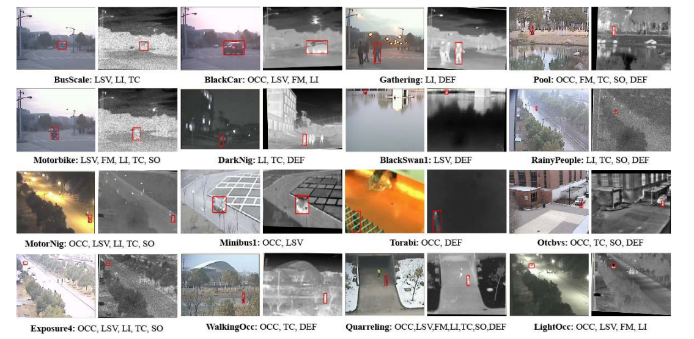
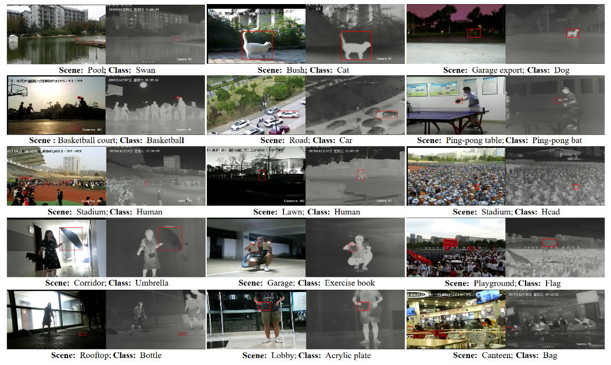
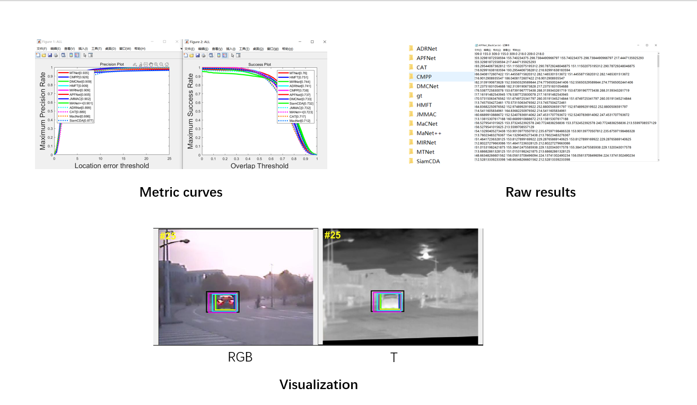

# RGBT-Tracking
This repository contains the necessary tools for RGBT tracking, including datasets（GTOT, RGBT234, LasHeR）, evaluation tools, visualization tools, and results of existing works.

## ☘️Datasets☘️

### 🌟GTOT🌟

This dataset is derived from the paper "Learning Collaborative Sparse Representation for Grayscale-thermal Tracking" published in 2016 IEEE Transactions on Image Processing (T-IP) by Li et al. from the research group led by Professor Chenglong Li at Anhui University.

The dataset comprises 50 video pairs consisting of sequences of grayscale and thermal infrared images, with each pair having statistical bias. Additionally, the dataset includes ground truth annotations for each frame of the videos and two evaluation metrics.

For more information about the dataset and to download it, please visit [gtot.md](https://github.com/xuboyue1999/RGBT-Tracking/blob/main/datasets/GTOT/gtot.md)

 

### 🌟RGBT234🌟

This dataset is from the paper "RGB-T Object Tracking: Benchmark and Baseline" published in 2019 Pattern Recognition (PR) by Li et al. from the research group led by Professor Chenglong Li at Anhui University.

Key features of the dataset include:

The dataset comprises 234 pairs of RGB-T video sequences along with their corresponding ground truth annotations (GroundTruth).
The video sequences are labeled with 12 attributes.
The total number of frames in the dataset is 234,000, with the longest video sequence containing 8,000 frames.

For more information about the dataset and to download it, please visit [rgbt234.md](https://github.com/xuboyue1999/RGBT-Tracking/blob/main/datasets/RGBT234/rgbt234.md)

 

### 🌟LasHeR🌟

LasHeR consists of 1224 visible and thermal infrared video pairs with more than 730K frame pairs in total. Each frame pair is spatially aligned and manually annotated with a bounding box, making the dataset well and densely annotated. LasHeR is highly diverse capturing from a broad range of object categories, camera viewpoints, scene complexities and environmental factors across seasons, weathers, day and night. Induced by real-world applications, several new challenges are take into consideration in data creation.

For more information about the dataset and to download it, please visit [lasher.md](https://github.com/xuboyue1999/RGBT-Tracking/blob/main/datasets/LasHeR/LasHeR.md)

 

## ☘️Evaluation☘️

The primary evaluation metrics for RGBT single-object tracking include **Precision Rate(PR), Success Rate (SR), and Normalized Precision Rate(NPR)**.

**PR** is a measure that describes the Euclidean distance between the center points of the predicted bounding box and the ground truth bounding box. It is generally considered that if the Euclidean distance between the center points of the ground truth bounding box and the predicted bounding box is less than 20 pixels, it indicates accurate localization. However, **in the GTOT dataset, this threshold is set to 5 pixels**.

The formula for PR is **PR = NP/NT**,

where NP represents the number of frames where the distance between the tracked algorithm's located target center point and the true target center point is less than a certain threshold, and NT represents the total number of frames.

**SR** is calculated by measuring the intersection-over-union (IoU) of pixels within the predicted bounding box and the ground truth bounding box. If the IoU exceeds a certain threshold, it is considered a successful tracking. 

The formula for SR is **SR = NS/NT**, 

where NS represents the number of frames in which the tracking algorithm successfully tracked the target, and NT represents the total number of frames.

**NPR**, which stands for Normalized Precision, involves normalizing the predicted bounding box (bbox) and ground truth bbox. By doing so, the performance of the model can be assessed without considering the size of the image resolution.
### 🌟GTOT🌟
We have developed a MATLAB-based evaluation toolbox for GTOT, which includes 

* **methods for calculating PR and SR metrics, generating metric curves, and comparing with existing trackers**
* **the original tracking result files for the majority of existing trackers**
* **visualization and analysis methods for tracking**
* etc

**For detailed instructions on how to use the toolbox and for more information, please refer to the documentation available at [GTOT-toolkit](https://github.com/xuboyue1999/RGBT-Tracking/blob/main/GTOT-toolkit/readme.md). It will provide comprehensive guidance on utilizing the toolbox and accessing additional details about its functionality.**

 

#### 🏆conparision🏆
Here are the metrics of existing trackers on the GTOT dataset:
 

The sources of the trackers are indicated in the following table:

Tracker | Paper | year | Source
----|----|----|----
**MTNet**  | [MTNet: Learning Modality-aware Representation with Transformer for RGBT Tracking](https://github.com/xuboyue1999/MTNet-ICME23) | 2023 | ICME
**HMFT**  | [Visible-thermal uav tracking: A large-scale benchmark and new baseline](https://openaccess.thecvf.com/content/CVPR2022/papers/Zhang_Visible-Thermal_UAV_Tracking_A_Large-Scale_Benchmark_and_New_Baseline_CVPR_2022_paper.pdf) | 2022 | CVPR  
**MIRNet**  |  [Mirnet: A robust rgbt tracking jointly with multi-modal interaction and refinement](https://ieeexplore.ieee.org/abstract/document/9860018) | 2022 | ICME
**ADRNet**  |  [Learning Adaptive Attribute-Driven Representation for Real-Time RGB-T Tracking](https://link.springer.com/article/10.1007/s11263-021-01495-3) | 2020 | IJCV 
**CMPP**  |  [Cross-modal pattern-propagation for rgb-t tracking](https://openaccess.thecvf.com/content_CVPR_2020/html/Wang_Cross-Modal_Pattern-Propagation_for_RGB-T_Tracking_CVPR_2020_paper.html) | 2020 | CVPR    
**APFNet**  |   [Attribute-based progressive fusion network for rgbt tracking](https://ojs.aaai.org/index.php/AAAI/article/view/20187) | 2022 | AAAI
**DMCNet**  |  [Duality-gated mutual condition network for rgbt tracking](https://ieeexplore.ieee.org/abstract/document/9737634) | 2022 |IEEE TNNLS
**SiamCDA** |  [Siamcda: Complementarityand distractor-aware rgb-t tracking based on siamese network](https://ieeexplore.ieee.org/abstract/document/9399460) | 2022 | TCSVT    
**JMMAC**  |   [Jointly modeling motion and appearance cues for robust rgb-t tracking](https://ieeexplore.ieee.org/abstract/document/9364880) | 2021 |IEEE Transactions on Image Processing 
**MANet** |  [Multi-adapter RGBT tracking](https://openaccess.thecvf.com/content_ICCVW_2019/html/VOT/Li_Multi-Adapter_RGBT_Tracking_ICCVW_2019_paper.html) | 2019 |ICCVW
**CAT**  |  [ Challenge-aware RGBT tracking](https://link.springer.com/chapter/10.1007/978-3-030-58542-6_14) | 2020 |ECCV
**MacNet**  |  [  Object tracking in RGB-T videos using modal-aware attention network and competitive learning](https://www.mdpi.com/1424-8220/20/2/393) | 2020 |Sensors

### 🌟RGBT234🌟

🚧building🚧

### 🌟LasHeR🌟
