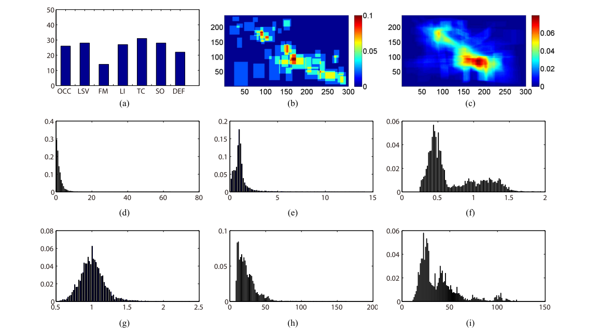
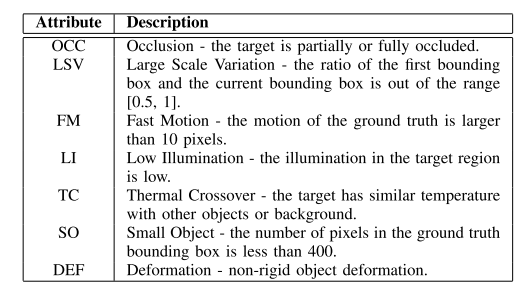

# Learning Collaborative Sparse Representation for Grayscale-Thermal Tracking

[paper](https://ieeexplore.ieee.org/abstract/document/7577747)

## Introduction
GTOT collected 50 grayscale-thermal video clips under different scenarios and conditions, e.g., **office areas**, **public roads**, and **water pool**, etc. Each grayscale video is paired with one thermal video. GTOT manually annotated them with ground truth bounding boxes. All annotations are done by a full-time annotator, to guarantee consistency. 

## Statistics

(a) Attribute distribution of entire dataset. 
(b) Distribution of first frame bounding boxes. 
(c) Distribution of all bounding boxes.
(d) Distance between consecutive frames. 
(e) Relative area to first frame bounding box. 
(f) Width-height ratio of all bounding boxes.
(g) Width-height ratio of first frame bounding boxes. 
(h) Width distribution of all bounding boxes. 
(i) Height distribution of all bounding boxes

## Attributes  

### Dataset file structure
 sequence   
  ├─i  
  │────00001_i.jpg  
  │────00002_i.jpg  
  │────00003_i.jpg  
  │  
  ├─v 
  │────00001_v.jpg  
  │────00002_v.jpg  
  │────00003_v.jpg  
  │    
  ├─groundTruth_i.txt  
  ├─init.txt  
  └─groundTruth_v.txt

### Download

Download GTOT from [BaiduNetdisk](https://pan.baidu.com/s/1oxBE7f4L_3781COvz30W2Q)  (Password:6j68 )

