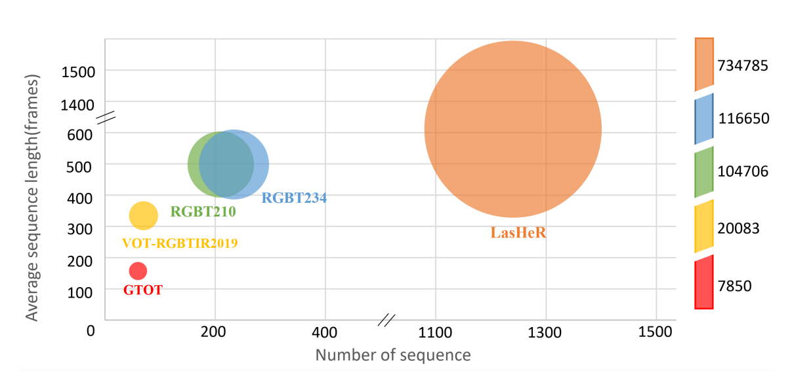
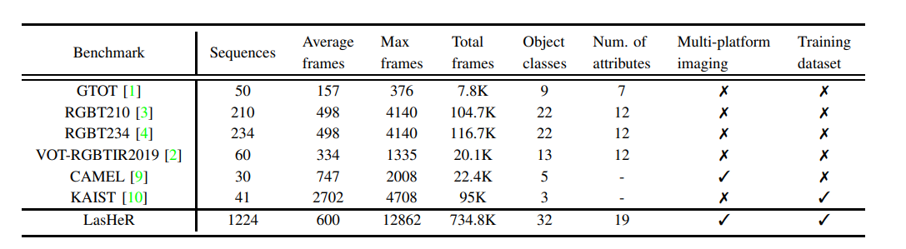

# LasHeR : A Large-scale High-diversity Benchmark for RGBT Tracking

[paper](https://arxiv.org/pdf/2104.13202.pdf)

[official repository](https://github.com/BUGPLEASEOUT/LasHeR)

## Introduction
LasHeR consists of **1224** visible and thermal infrared video pairs with **more than 730K** frame pairs in total. Each frame pair is spatially aligned and manually annotated with a bounding box, making the dataset well and densely annotated.
LasHeR is highly diverse capturing from a broad range of **object categories**, **camera viewpoints**, **scene complexities** and **environmental factors** across seasons, weathers, day and night. Induced by real-world applications, several **new challenges** are take into consideration in data creation. 
* **Large-scale**
* **Multi-platform imaging devices**
* **Rich scenes and categories**
* **Real-world challenges**

## Attributes
    
Attr | Description  
----|----
**NO**  |  No Occlusion - the target is not occluded.  
**PO**  |  Partial Occlusion - the target object is partially occluded.  
**TO**  |  Total Occlusion - the target object is totally occluded.  
**HO**  |  *Hyaline Occlusion* - the target is occluded by hyaline object.  
**OV**  |  Out-of-View - the target leaves the camera field of view.  
**LI**  |  Low Illumination - the illumination in the target region is low.
**HI**  |  *High Illumination* - the illumination in the target is too strong to identify the target.  
**AIV** |  *Abrupt Illumination Variation* - the illumination of the target changes significantly.  
**LR**  |  Low Resolution - the resolution in the target region is low.  
**DEF** |  Deformation - non-rigid object deformation.  
**BC**  |  Background Clutter - the background information which includes the target object is messy.  
**SA**  |  *Similar Appearance* - there are objects of similar shape near the target.  
**TC**  |  Thermal Crossover - the target has similar temperature with other objects or background surroundings.  
**MB**  |  Motion Blur - the target object motion results in the blur image information.  
**CM**  |  Camera Moving - the target object is captured by moving camera.  
**FL**  |  *Frame Lost* - some of thermal or visible frames are lost.  
**FM**  |  Fast Motion - the motion of the ground truth between two adjacent frames is larger than 20 pixels.  
**SV**  |  Scale Variation - the ratio of the first bounding box and the current bounding box is out of the range [0.5,2].  
**ARC** |  *Aspect Ratio Change* - the ratio of bounding box aspect is outside the range [0.5,2]

### Dataset file structure
 sequence   
  ├─infrared  
  │────i000.jpg  
  │────i001.jpg  
  │────i002.jpg  
  │  
  ├─visible  
  │────v000.jpg  
  │────v001.jpg  
  │────v002.jpg  
  │    
  ├─infrared.txt  
  ├─init.txt  
  └─visible.txt

### Download

Download LasHeR from [BaiduNetdisk](https://pan.baidu.com/s/1hZgK_OMHNp0fN20SJNNm9w)  (Password:mmic)   [BaiduNetdisk2](https://pan.baidu.com/s/1hnNwGmdvcFO6_n2Tx-MMBg)  (Password:mmic) or [TeraBox](https://terabox.com/s/1GgKDG3wXVNYZiX97sUzJZQ) (Password: yfi0).

