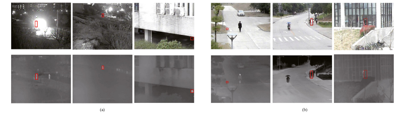

# RGB-T Object Tracking: Benchmark and Baseline

[paper](https://arxiv.org/pdf/1805.08982.pdf)

[official repository](https://sites.google.com/view/ahutracking001/)

## Introduction
RGB-Thermal (RGB-T) object tracking receives more and more attention due to the strongly complementary benefits of the thermal information to the visible data. However, the related research is limited by a comprehensive evaluation platform. In this paper, we contribute a video benchmark dataset for the RGB-T tracking purpose. It has three major advantages over existing ones: 1) Its size is sufficiently large for large-scale performance evaluation (total frame number: 233.8K, maximum frame per sequence: 8K). 2) The alignment between RGB-T sequence pairs is highly accurate, which does not need pre- and post-processing. 3) The occlusion levels are annotated for analyzing the occlusion-sensitive performance of different tracking algorithms. Moreover, we propose a novel graph-based approach to learn a robust object representation for RGB-T tracking. In particular, the tracked object is represented with a graph with image patches as nodes. This graph is dynamically learned in a single unified optimization framework from two aspects. First, the graph affinity is optimized based on the weighted sparse representation, in which the modality weight is introduced to leverage RGB and thermal information adaptively. Second, each graph node (i.e., image patch) weight is propagated from the initial ones along with graph affinity. The optimized patch weights are then imposed on the extracted RGB and thermal features,and the target object is finally located by adopting the structured SVM algorithm. Extensive experiments on both public and newly created datasets demonstrate the effectiveness of the proposed tracker against several state-of-the-art tracking methods.

* **We have annotate the sequences with 12 attributes, which represents the challenging aspects in visual tracking.**
* **RGB and thermal source data all  has annotated the corresponding grouth-truth.**
* **Each row in the grouth-truth files represents the bounding box of the target in that frame,(x,y,box-width,box-height).**

Attr | Description  
----|----
**NO**  |  No Occlusion - the target is not occluded.  
**PO**  |  Partial Occlusion - the target object is partially occluded.  
**HO**  |  *Hyaline Occlusion* - the target is occluded by hyaline object.    
**LI**  |  Low Illumination - the illumination in the target region is low.
**LR**  |  Low Resolution - the resolution in the target region is low. 
**TC** |  Thermal Crossover - the target has similar temperature with other objects or background   surroundings. 
**DEF** |  Deformation - non-rigid object deformation.  
**FM**  |  Fast Motion - the motion of the ground truth between two adjacent frames is larger than 20 pixels.  
**SV**  |  Scale Variation - the ratio of the first bounding box and the current bounding box is out of the range [0.5,2].  
**MB**  |  Motion Blur - the target object motion results in the blur image information.  
**CM**  |  Camera Moving - the target object is captured by moving camera.  
**BC**  |  Background Clutter - the background information which includes the target object is messy.  

distribution of visual attributes within RGBT234 dataset

### Dataset file structure
 sequence   
  ├─infrared  
  │────00001i.jpg  
  │────00002i.jpg  
  │────00003i.jpg  
  │  
  ├─visible  
  │────00001v.jpg  
  │────00002v.jpg  
  │────00003v.jpg  
  │    
  ├─infrared.txt  
  ├─init.txt  
  └─visible.txt

### Download

Download RGBT234 from [BaiduNetdisk](https://pan.baidu.com/s/1tZbyfVRbUaFVkZEaerz3Aw )  (Password:622g)  
